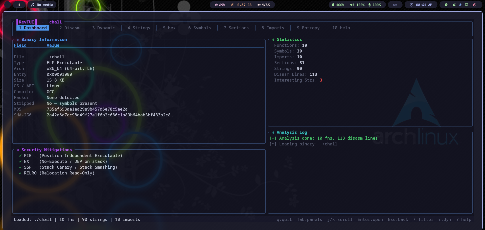
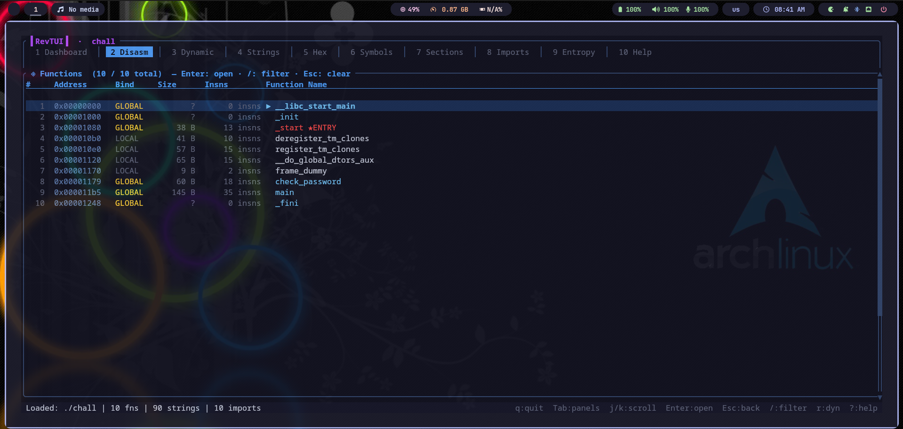
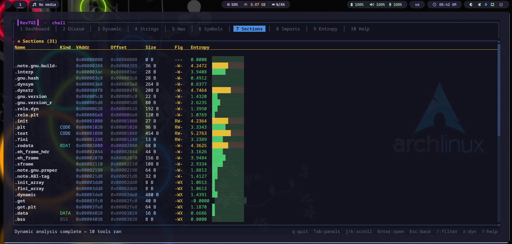
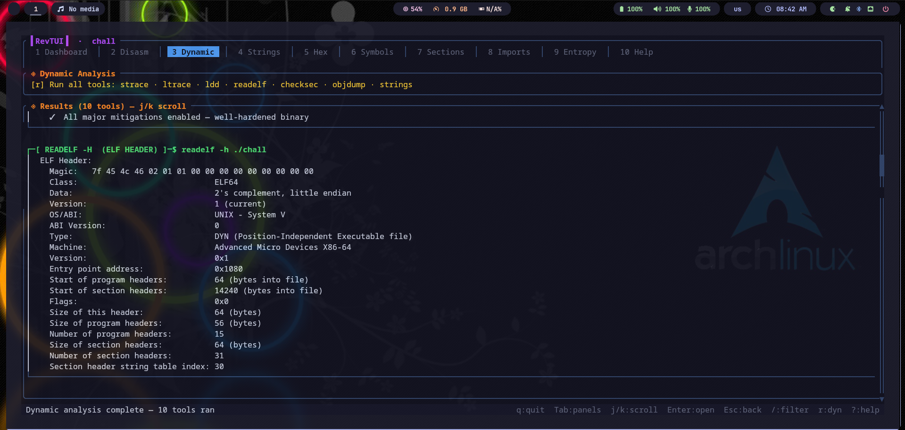
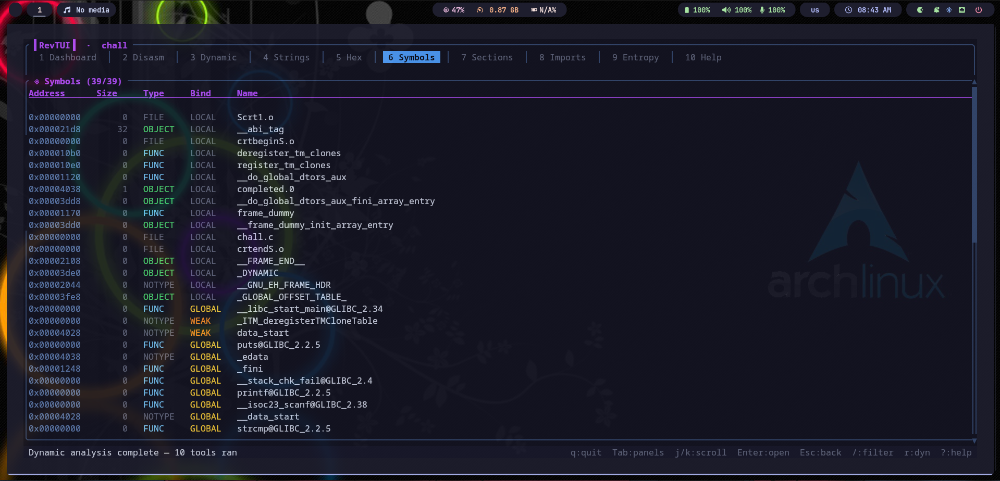
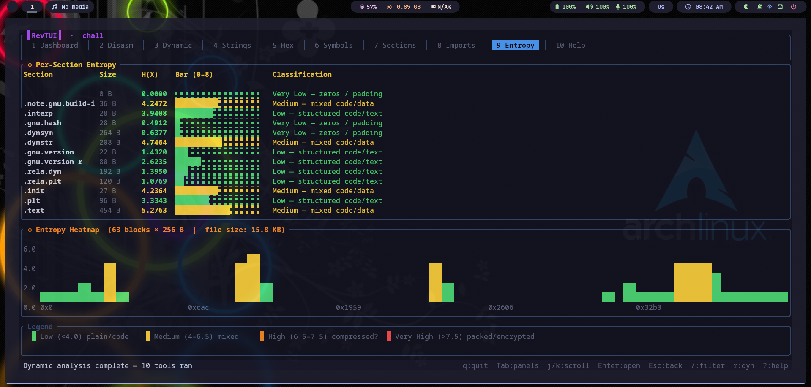

# RevTUI — Advanced Reverse Engineering Terminal UI
 
A powerful, fully terminal-based reverse engineering tool built in **Rust** with a beautiful **Ratatui** TUI. Designed for real-world binary analysis — static, dynamic, and visual — without ever leaving your terminal.
 

 ```
 ▌RevTUI▐  ·  vault
 ┌────────────────────────────────────────────────────────────────────┐
 │ 1 Dashboard │ 2 Disasm │ 3 Dynamic │ 4 Strings │ 5 Hex │ ...       │
 └────────────────────────────────────────────────────────────────────┘
```
---
 
## Features
 
### Static Analysis
| Panel | What it shows |
|-------|--------------|
| **Dashboard** | File type, architecture, entry point, MD5/SHA256, compiler hint, packer detection, security mitigations |
| **Disasm** | Function browser → linear disassembly → CFG graph (powered by Capstone + Graphviz) |
| **Strings** | ASCII + UTF-16 strings classified as: URL / IP / Path / Registry / Interesting / Encoded |
| **Hex** | Full xxd-style hex dump with ASCII sidebar |
| **Symbols** | ELF/PE symbol table with type (FUNC/OBJECT) and binding (GLOBAL/LOCAL/WEAK) |
| **Sections** | Section headers with virtual address, offset, size, flags, and per-section entropy bar |
| **Imports** | All imported functions, auto-categorised: NET / FILE / PROC / MEM / CRYPT / REG / DBG |
| **Entropy** | Full-file entropy heatmap (256-byte blocks) + per-section entropy gauge |
 
### Disassembly — Three Views
```
Function List  →[Enter]→  Linear Disasm  →[v]→  CFG Graph
     ↑                         ↑                     ↑
   [Esc]                     [Esc]                 [Esc]
```
 
- **Function List** — browse all functions with address, binding, size, instruction count, and live `/` filter
- **Linear Disasm** — full disassembly with relative `+offset`, byte dump, colour-coded mnemonics, and resolved call targets (e.g. `call strcmp@plt`)

 
### Dynamic Analysis (press `r` in panel 3)
| Tool | What it does |
|------|-------------|
| `file` | File type fingerprint |
| `ldd` | Shared library dependencies |
| `readelf -h/-d/-l` | ELF header, dynamic section, program headers |
| `checksec` | Security mitigations — auto-detects shell/Python version, built-in fallback |
| `strace -c` | System call summary and counts |
| `ltrace -c` | Library call summary and counts |
| `objdump -d .plt` | PLT stub disassembly |
| `strings -n 6` | Printable string extraction |
 
### Security Mitigation Detection (built-in, no checksec needed)
- **PIE** — `ET_DYN` in ELF header
- **NX / DEP** — `GNU_STACK` segment flags
- **Stack Canary** — `__stack_chk_fail` in dynamic symbols
- **RELRO** — Partial (`PT_GNU_RELRO`) and Full (`BIND_NOW`)
- **Fortify** — `_chk`-suffixed function symbols
---
 
## Screenshots

A full static and dynamic analysis suite — every panel designed for real reverse engineering workflows.

<table>
  <tr>
    <td align="center"><b>Dashboard</b></td>
    <td align="center"><b>Disasm</b></td>
  </tr>
  <tr>
    <td></td>
    <td></td>
  </tr>
  <tr>
    <td align="center"><b>Sections</b></td>
    <td align="center"><b>Dynamic Analysis</b></td>
  </tr>
  <tr>
    <td></td>
    <td></td>
  </tr>
  <tr>
    <td align="center"><b>Symbols</b></td>
    <td align="center"><b>Entropy</b></td>
  </tr>
  <tr>
    <td></td>
    <td></td>
  </tr>
</table>

---
 
## Installation
 
### Requirements
- **Rust 1.75+** — install from [rustup.rs](https://rustup.rs)
- **Linux** (x86_64 / ARM64)
### Build
```bash
git clone https://github.com/aditya-bhos04/revtui
cd revtui
cargo build --release
./target/release/revtui --help
```
 
### Install system-wide
```bash
sudo cp target/release/revtui /usr/local/bin/
```
 
### Optional tools (strongly recommended)
```bash
# Ubuntu / Debian / Kali
sudo apt install graphviz strace ltrace binutils file checksec
 
# Fedora / RHEL
sudo dnf install graphviz strace ltrace binutils file
```
 
> **graphviz** gives the best CFG layout. Without it, RevTUI falls back to its own BFS layout automatically.
 
---
 
## Usage
 
```bash
# Analyze any ELF or PE binary
revtui /bin/ls
revtui ./challenge_binary
 
# Start directly in dynamic analysis tab
revtui ./binary --dynamic
 
# Help
revtui --help
```
 
---
 
## Keyboard Reference
 
### Navigation
| Key | Action |
|-----|--------|
| `Tab` / `→` | Next panel |
| `Shift+Tab` / `←` | Previous panel |
| `1` – `0` | Jump directly to panel |
| `j` / `↓` | Scroll / select down |
| `k` / `↑` | Scroll / select up |
| `d` / `PgDn` | Page down |
| `u` / `PgUp` | Page up |
| `g` | Jump to top |
| `G` | Jump to bottom |
| `q` / `Ctrl+C` | Quit |
 
### Disasm Panel
| Key | Action |
|-----|--------|
| `Enter` | Open selected function (linear view) |
| `v` | Open CFG graph for selected function |
| `Esc` | Go back (list → detail → list) |
| `/` | Filter functions by name or address |
 
### CFG Graph
| Key | Action |
|-----|--------|
| `j` / `k` | Scroll vertically |
| `h` / `l` or `←` / `→` | Pan left / right |
| `g` | Reset to origin |
| `v` | Rebuild graph |
| `Esc` | Back to linear disasm |
 
### Actions
| Key | Action |
|-----|--------|
| `/` | Open search / filter bar |
| `r` | Run all dynamic tools (Dynamic panel) |
| `e` | Show binary info popup |
| `?` / `F1` | Help screen |
 
---
 
## Supported Formats & Architectures
 
**Binary formats:** ELF (Linux), PE (Windows DLL/EXE)
 
**Architectures:** x86, x86_64, ARM, AArch64, MIPS, RISC-V, PowerPC
 
---
 
## Project Structure
 
```
src/
├── main.rs       — Entry point, terminal setup, main loop
├── app.rs        — Application state, tab management, scroll state
├── ui.rs         — All Ratatui rendering (10 panels, ~1150 lines)
├── analysis.rs   — Static analysis: ELF/PE parsing, Capstone disassembly,
│                   string extraction, entropy, symbol/import resolution
├── cfg.rs        — CFG builder, graphviz layout + edge routing, ASCII renderer
├── dynamic.rs    — Dynamic analysis: strace/ltrace/ldd/checksec/readelf runners,
│                   smart checksec version detection, built-in security checker
├── events.rs     — Keyboard event handling
└── utils.rs      — Hex formatting, entropy bars, string helpers
```
 
---
 
## Dependencies
 
| Crate | Purpose |
|-------|---------|
| [ratatui](https://github.com/ratatui-org/ratatui) | Terminal UI framework |
| [crossterm](https://github.com/crossterm-rs/crossterm) | Cross-platform terminal control |
| [capstone](https://github.com/capstone-rust/capstone-rs) | Multi-arch disassembly engine |
| [goblin](https://github.com/m4b/goblin) | ELF/PE/Mach-O binary parser |
| [sha2](https://github.com/RustCrypto/hashes) | SHA-256 hashing |
| [md5](https://github.com/stainless-steel/md5) | MD5 hashing |
| [anyhow](https://github.com/dtolnay/anyhow) | Error handling |
| [serde / serde_json](https://github.com/serde-rs/serde) | Serialisation |
 
---
 
## Special Thanks
 
### 🐭 Ratatui
 
A huge and sincere thank you to the [**Ratatui**](https://github.com/ratatui-org/ratatui) team and contributors.
 
Ratatui made it possible to build a genuinely beautiful, responsive, and feature-rich terminal interface in Rust — without fighting the framework. The widget system, layout engine, and styling API are a joy to work with. RevTUI would not exist in its current form without the incredible work the Ratatui community has put in.
 
If you're building anything terminal-based in Rust, Ratatui is the library to reach for. Check it out at **[ratatui.rs](https://ratatui.rs)**.
 
 
 
## Contributing
 
Issues and pull requests are welcome. If you find a bug or want to add support for a new architecture or binary format, feel free to open an issue.